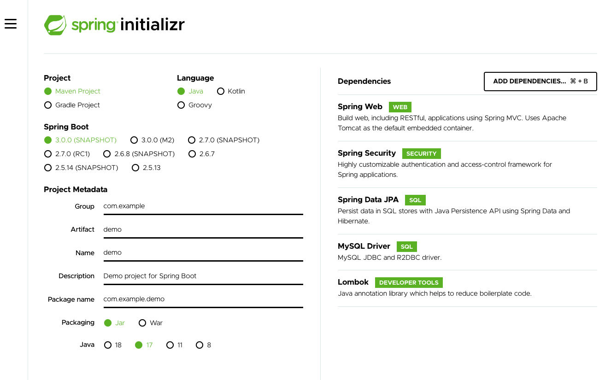

# Midterm project: Banking System

A working REST API, built by **Beatriz Pérez Fernández** for OpenBank-IronHack Java BootCamp that runs on a local server:

- GitHub repository :  [GitHub repository](https://github.com/Openbank-Java-Bootcamp/beatriz-perez-Midterm-Project-Banking-System.git)
- Simplified class diagram - project structure: [Class diagram](https://drive.google.com/file/d/1AzKxl9wNN_4bO68MQG1XOqBxD4r2wUzp/view?usp=sharing)
- Documentation in the README.md file: [README.md file](https://github.com/Openbank-Java-Bootcamp/beatriz-perez-Midterm-Project-Banking-System/blob/master/README.md)

***

## How to use it:
1. Download the **project**: [GitHub repository](https://github.com/Openbank-Java-Bootcamp/beatriz-perez-Midterm-Project-Banking-System.git)
2. Make sure your **DB** is ready for queries. You can use workbench and create an "ironhack_labs" schema to run the app (and an "ironhack_labs_test" schema to run the tests): [MySQL Workbench](https://www.mysql.com/products/workbench/)
3. Run the **app** from your IDE, for example IntelliJ IDEA. All entity tables will be created in the DB, go check it in workbench!: [IntelliJ IDEA](https://www.jetbrains.com/idea/promo/?source=google&medium=cpc&campaign=9736637745&term=intellij%20idea&gclid=Cj0KCQjwm6KUBhC3ARIsACIwxBiNkmA6c4mmEzhGgPIqwR7oB8EcwLAwNaYghuxPdrZg9VKEas3JgLMaAjX3EALw_wcB)
4. Use Postman to test all available **endpoints**. You'll see in workbench how DB tables reflect the changes you make :)  [Postman](https://www.postman.com/)

Use this Postman collection to test the app even faster:

***

## Project Structure

### 1. The system has 4 types of accounts: StudentChecking, Checking, Savings, and CreditCard

### 2. The system has 3 types of Users: Admins, Third-party Users and AccountHolders

### 3. Admins can create new Checking, Savings, or CreditCard Accounts

### 4. Interest and Fees are applied automatically every time an account is accessed

### 5. Account Access

#### ANYONE can access:
- log in endpoint: http://localhost:8080/api/login
- third party transactions endpoint:  PATCH http://localhost:8080/api/accounts/third-party-transaction

#### Only ACCOUNT HOLDERS can access:
- endpoint to get a list of all YOUR active accounts (as primary OR secondary owner): GET http://localhost:8080/api/account-holder/accounts
- endpoint to get the details of one of YOUR accounts by account number: GET http://localhost:8080/api/account-holder/accounts/{account-number}
- endpoint to transfer money from one of YOUR accounts to any other existing account (if funds or credit are sufficient): PATCH http://localhost:8080/api/account-holder/transfer

#### Only ADMIN role users can access:
- endpoint to get a list of all existing roles: GET http://localhost:8080/api/roles
- endpoint to create a new role: POST http://localhost:8080/api/roles
- endpoint to assign a role to a user manually: POST http://localhost:8080/api/roles/assign

- endpoint to get a list of all active users: GET http://localhost:8080/api/users
- endpoint to get the details of any user by ID: GET http://localhost:8080/api/users/{id}
- endpoint to get a list of all active third parties: GET http://localhost:8080/api/users/third-party

- endpoint to create a new admin-user: POST http://localhost:8080/api/users/admin-user
- endpoint to create a new AccountHolder user: POST http://localhost:8080/api/users/account-holder
- endpoint to create a new ThirdParty user: POST http://localhost:8080/api/users/third-party

- endpoint to update an admin-user: PUT http://localhost:8080/api/users/admin-user/{id}
- endpoint to update an AccountHolder user: PUT http://localhost:8080/api/users/account-holder/{id}
- endpoint to update a ThirdParty user: PUT http://localhost:8080/api/users/third-party/{id}

- endpoint to delete a user by ID: DELETE http://localhost:8080/api/users/{id}
- endpoint to delete a ThirdParty user by ID: DELETE http://localhost:8080/api/users/third-party/{id}

- endpoint to get a list of all active accounts: GET http://localhost:8080/api/accounts
- endpoint to get a list of all active accounts by owner ID (primary AND secondary owner): GET http://localhost:8080/api/accounts/user/{owner-id}
- endpoint to get the details of any account by account number: GET http://localhost:8080/api/accounts/{account-number}

- endpoint to create a new Checking Account: POST http://localhost:8080/api/accounts/checking
- endpoint to create a new Credit Card Account: POST http://localhost:8080/api/accounts/credit-card
- endpoint to create a new Savings Account: POST http://localhost:8080/api/accounts/savings

- endpoint to freely modify an account's balance: PATCH http://localhost:8080/api/accounts/{account-number}

- endpoint to delete an account by account number: DELETE http://localhost:8080/api/accounts/{account-number}

***

### Technical Requirements
- Include a Java/Spring Boot backend.
- Everything should be stored in MySQL database tables.
- Include at least 1 GET, POST, PUT/PATCH, and DELETE route.
- Include authentication with Spring Security.
- Include unit and integration tests.
- Include robust error handling.
- You must use the Money class for all currency and BigDecimal for any other decimal or large number math.

### Extra features (bonus)
#### Fraud Detection
The application must recognize patterns that indicate fraud and Freeze the account status when potential fraud is detected.
Patterns that indicate fraud include:
- Transactions made in 24 hours total to more than 150% of the customers highest daily total transactions in any other 24 hour period.
- More than 2 transactions occur on a single account within a 1 second period.

      

***

## How the project was built:

- Task management in Trello:

   [Trello tasks board](https://trello.com/invite/b/uEPSEIQa/8df7c946d07d38e4d7ce9ce5a126751e/midtermbankingsystem)

### Steps

1. Download PROJECT STRUCTURE and dependencies from [start.spring.io](https://start.spring.io/)

    Spring Boot set up with **spring Initializr**:

    

2. Model: CREATE ENTITIES
   - Create entities for accounts and users and establish their properties and relationships
   - Create auxiliary classes and enums (Status, Money...)
   - Add dependencies and application properties for validation
   - Add conditions for each entity property when needed

3. Repository: COMMUNICATE WITH DATABASE
   - Create repositories for all entities: roles, accounts and users to communicate with the DataBase

4. Service: CREATE METHODS AND ADD BUSINESS LOGIC
   - Create service interfaces for all entities: roles, accounts and users to include methods to implement
   - Create service implementations (classes) for all entities: roles, accounts and users to implement methods

5. Controller: create ENDPOINTS and add methods for requests
   - Create controller interfaces for all entities: roles, accounts and users to include methods to implement
   - Create controller implementations (classes) for all entities: roles, accounts and users to implement methods and establish endpoint routes

6. Security configuration, AUTHENTICATION and AUTHORIZATION
   - Add dependencies: jwt dependency
   - Add filters for authentication and authorisation
   - Add a security configuration file
   - Use PasswordEncoder to encode passwords

***

