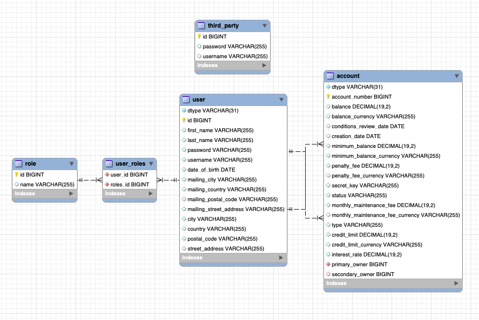
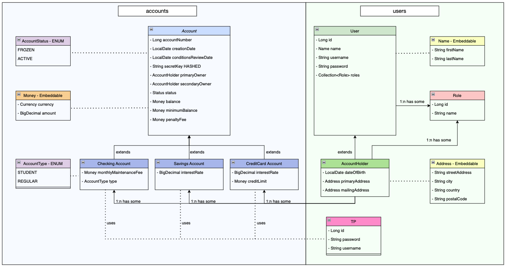

# Midterm project: Banking System

A working **REST API**, built by **Beatriz Pérez Fernández** for OpenBank-IronHack Java BootCamp  
that runs on a local server:

- GitHub repository :  [GitHub repository](https://github.com/Openbank-Java-Bootcamp/beatriz-perez-Midterm-Project-Banking-System.git)
- Documentation in the README.md file: [README.md file](https://github.com/Openbank-Java-Bootcamp/beatriz-perez-Midterm-Project-Banking-System/blob/master/README.md)
    
***

## Readme index:
- [How to use the files](#how-to-use-the-files)
- [Description of the project and main features](#description-of-the-project)
- [Extra features](#setup-and-technologies-used)
- [Bonus: Fraud Detection](#bonus-fraud-detection)
- [Setup and technologies used](#setup-and-technologies-used)
- [Project Structure and requirements](#project-Structure)
  - [Class diagram](#simplified-class-diagram)
  - [4 types of accounts](#accounts)
  - [3 types of Users + 2 Roles](#users)
  - [create new Checking, Savings, or CreditCard Accounts](#create-accounts)
  - [Interest and Fees](#interest-and-fees)
  - [Account Access - endpoints](#account-access)

***

## How to use the files
1. Download the **project**: [GitHub repository](https://github.com/Openbank-Java-Bootcamp/beatriz-perez-Midterm-Project-Banking-System.git)

2. Make sure your **DB** is ready for queries.  
   You can use workbench and create an "ironhack_labs" schema to run the app (and an "ironhack_labs_test" schema to run the tests): [MySQL Workbench](https://www.mysql.com/products/workbench/)

3. Run the **app** from your IDE, for example IntelliJ IDEA.  
   All entity tables will be created in the DB, go check it in workbench!: [IntelliJ IDEA](https://www.jetbrains.com/idea/promo/?source=google&medium=cpc&campaign=9736637745&term=intellij%20idea&gclid=Cj0KCQjwm6KUBhC3ARIsACIwxBiNkmA6c4mmEzhGgPIqwR7oB8EcwLAwNaYghuxPdrZg9VKEas3JgLMaAjX3EALw_wcB)

4. Use Postman to test all available **endpoints**.  
   You'll see in workbench how DB tables reflect the changes you make :)  [Postman](https://www.postman.com/)    
   Use this Postman collection to test the app even faster:    
   
 

***

## Description of the project

This is an API for a banking system where registered users can log in, access their accounts and transfer money.

**Admin users** are the ones who can create new accounts and modify their properties freely, change their balance or delete them.
They can also create new users, who can be new admin users or account holders.
Admins can also store in the database third party users (external users, stores, services, etc. that might charge or refund amounts to accounts).

**Account holders** can be primary or secondary owners of any type of account. 
Once logged in, they can access the information of their own accounts and transfer money from them to any other account in the DB.

**Third Party** users can charge or make refunds to accounts as long as they are registered in the database and provide the account number and secret key.
These users will not own any accounts or have a role. When created, they will just provide a username and a password to be stored in the DB.
They do not log in, and can not get any information from other users or accounts.

Available account types:

**Checking accounts** are created with different properties depending on the age of the primary owner.
If it is below 24, the account will not have a minimum balance or a monthly maintenance fee. 
Once the owner becomes 24, conditions will be updated and maintenance fee will be applied.

**Savings accounts** have an interest rate that is applied automatically every year.

**Credit Card accounts** have a minimum balance according to their credit limit, and an interest rate that is deducted automatically once a month if balance is negative.

**Penalty fees** are applied if an account's balance goes below the minimum balance.

 

***

## Extra features
- **Roles:** roles are the way to control authorization. Admin users can create new roles and assign them to any user in case new functionalities where to be added. Modifying and deleting roles is not allowed, since it could make the application stop working.
- **Creating a user:** any time a user or an account holder is created **corresponding roles are assigned automatically**. User instances get a ROLE_ADMIN while AccountHolder instances get a ROLE_ACCOUNTHOLDER.
- **Deleting a user:** when a user is deleted, the application **automatically searches for accounts where this user is primary or secondary owner**, and alerts for them to be deleted before deleting the user. This avoids future errors handling those accounts.
- **Creating an account:** when a new account is created, the admin user only sets the currency once. The application **automatically sets all needed values to use this currency** avoiding possible errors. If needed, admin users can change these values individually through the put endpoint created for account updates.
- **Account currency:** any time a user operates with an account **the application checks all involved currencies to make sure they match**. In case currencies are different the app alerts the user to avoid errors in transactions where a previous conversion is needed.
- **Checking account type:** when a checking account is created, it's type, maintenance fee and minimum balance are set depending on the age of the primary owner. Once created, the app automatically checks the owner's age any time the account is accessed. When a STUDENT account holder becomes 24 the app **automatically updates the account's type from STUDENT to REGULAR** and sets the corresponding minimum balance and maintenance fee.
- **CreditCard account credit:** when a credit card account type is created, minimum balance is set to the negative value of its credit limit. Any time a user tries to charge or transfer money from a credit card account the application checks this minimum balance instead of the actual balance to allow the user to benefit from credit. 
- **CreditCard account interest:** monthly interest in credit accounts **is deducted** from the account balance every month **if balance is below 0, which means the owner is borrowing money from the bank**. This interest is only applied to negative balance, so no interest is applied when balance is positive. 
    
- 
***

## Bonus: Fraud Detection
- **Account status:** when an account is created it's status is set by default to ACTIVE.
- **Last transaction date:** the date of the last transaction of each account is stored in the account DB table.
- **Fraud detection:** each time a transfer is done by an account holder or a transaction from a third party is processed **checkForFraud method** checks the time duration between this transaction and the previous one. If it is smaller than one second it changes the status of the account to FROZEN. Then it checks the status of the account and only allows the transaction if it is ACTIVE.

    

***

## Setup and technologies used

- Task management in Trello: [Trello tasks board](https://trello.com/invite/b/uEPSEIQa/8df7c946d07d38e4d7ce9ce5a126751e/midtermbankingsystem)

1. Java/Spring Boot backend. Project structure created with [start.spring.io](https://start.spring.io/)

   

2. Model: **ENTITIES**
    - entities for accounts and users, properties and relationships (Jakarta persistence + Lombok)
    - auxiliary classes and enums (Status, Money, Address...)
    - dependencies and application properties for validation (Spring Boot validation)
    - conditions for each entity property when needed
    * Money class for all currency and BigDecimal for any other decimal or large number

3. Repository: communicate with **DATABASE**
    - repositories for all entities: roles, accounts and users to communicate with the DataBase (Spring framework - JPA repository)
    - Everything is stored in MySQL database tables:

   

4. Service: methods and **BUSINESS LOGIC**
    - service interfaces for all entities: roles, accounts and users to include methods to implement
    - service implementations (classes) for all entities: roles, accounts and users to implement methods and handle possible errors (Spring framework service)

5. Controller: **ENDPOINTS** and methods for requests (GET, POST, PUT/PATCH, and DELETE route)
    - controller interfaces for roles, accounts and users to include methods to implement
    - controller implementations (classes) for roles, accounts and users to implement methods and establish endpoint routes (Spring framework REST controller)

6. Security configuration: **AUTHENTICATION** and **AUTHORIZATION** with Spring Security
    - dependencies: jwt dependency
    - filters for authentication and authorization
    - security configuration file - routes and allowed roles for each of them
    - PasswordEncoder to encode passwords every time a password or secret key is sent to the database

7. **Tests** and test application properties

***

## Project Structure
### Simplified class diagram

- editable class diagram - project structure: [Class diagram](https://drive.google.com/file/d/1AzKxl9wNN_4bO68MQG1XOqBxD4r2wUzp/view?usp=sharing)

***

## Accounts
### The system has 4 types of accounts: StudentChecking, Checking, Savings, and CreditCard

   ## Account class
   ### Parent class
   **Table name:** Account  
   **Inheritance type:** Single Table ---> All accounts will be added in this ONE table   
   **Properties:**   
    - Long accountNumber ---> Generated Value   
    - LocalDate creationDate ---> set by constructor  as the current date   
    - LocalDate conditionsReviewDate ---> set by constructor  as the current date   
    - String secretKey ---> HASHED KEY (encrypted before being saved in the DB) + Not Empty validation   
    - AccountHolder primaryOwner ---> User Class > AccountHolder Class (OneToOne relation) + Not Null validation   
    - AccountHolder secondaryOwner ---> User Class > AccountHolder Class (OneToOne relation) + not required   
    - Status status ---> Status Enum --> Set by constructor as ACTIVE   
    - Money balance ---> Embedded  + Not Null validation   
    - Money minimumBalance ---> Embedded  + Not Null validation   
    - Money penaltyFee ---> Embedded , amount = 40 (FINAL value), same Currency as balance   
     
   **Service methods:**   
    - getAllAccounts()  
    - getAllAccountsByOwner()  
    - getAllMyAccounts()  
    - getAccountByNumber()  
    - getMyAccountByNumber()  
    - updateAccountBalance()  
    - operateAsThirdParty()  
    - transferMoney()  
    - deleteAccountByNumber()  
    - getOwnerFromAuthentication()  
    - checkPenaltyAlreadyApplied()  
    - applyPenaltyFeeIfApplicable()  
    - checkConditions()  
    - checkFundsAndCredit()  

   ## Checking Account class
   ### Child class
   **Extends:** Account class  
   **Included in table:** Account  
   **Properties:**   
    - Money monthlyMaintenanceFee ---> Embedded  
    - AccountType type = REGULAR / STUDENT ---> AccountType Enum **Created as Student type by default**   
     
    * AccountType depends on the age of the primaryOwner: if it is less than 24, a Student type account is created otherwise a Regular Checking Account is created.   
    * When the primaryOwner of a Student Checking Account becomes 24 the account type is changed to REGULAR and conditions are changed (minimumBalance and monthlyMaintenanceFee) but the account is still valid and keeps it's original accountNumber.    
   **Conditions:**   
    - REGULAR CheckingAccounts: minimumBalance of 250  
    - STUDENT CheckingAccounts: minimumBalance of 0  
    - REGULAR CheckingAccounts: monthlyMaintenanceFee of 12  
    - STUDENT CheckingAccounts: monthlyMaintenanceFee of 0  
   **Service methods:**   
    - createCheckingAccount()  
    - checkAge()  
    * Penalty fees applied by Account Service    

   ## Savings Account class
   ### Child class
   **Extends:** Account class  
   **Included in table:** Account  
   **Properties:**   
    - BigDecimal interestRate ---> Decimal max + Decimal min validation  
     
   **Conditions:**   
    - Default interestRate of 0.0025 ---> Constructor overloading + chaining  
    - Default minimumBalance of 1000 ---> Constructor overloading + chaining  
    - interestRate max=0.5, min=0 - Controlled by **Spring Boot Validation** (min was not required, but was added to avoid negative interests)  
    - minimumBalance max=1000, min=100 - Controlled by the **SERVICE** with checkMinimumBalance() method  
   **Service methods:**   
    - createSavingsAccount()  
    - checkMinimumBalance()  
    * Penalty fees applied by Account Service  
    * Interest rates ADDED annually by Account Service **based on balance**   

   ## CreditCard Account class
   ### Child class
   **Extends:** Account class  
   **Included in table:** Account  
   **Properties:**   
    - BigDecimal interestRate ---> Decimal max + Decimal min validation  
    - Money creditLimit ---> Embedded  
     
   **Conditions:**   
    - **Minimum balance is set by constructor according to credit limit**  
    - Default creditLimit of 100 ---> Constructor overloading + chaining  
    - Default interestRate of 0.2  ---> Constructor overloading + chaining  
    - InterestRate max=0.2, min=0.1 - Controlled by **Spring Boot Validation**  
    - CreditLimit max=100000, min=100 - Controlled by the **SERVICE**  
   **Service methods:**   
    - createCreditCardAccount()  
    - checkCreditLimit()  
    * Penalty fees applied by Account Service  
    * Interest rates DEDUCTED monthly by Account Service **based on negative balance** (credit)   

***

## Users
### The system has 3 types of Users: Admins, Third-party Users and AccountHolders + 2 Roles

   ## User class
   ### Parent class
   **Table name:** User  
   **Inheritance type:** Single Table ---> All users will be added in this ONE table   
   **Properties:**   
    - Long id ---> Generated Value  
    - Name name ---> Embedded  
    - String username  ---> Not Empty validation  
    - String password  ---> Not Empty validation  
    - Collection<Role> roles ---> ManyToMany relation **User instances are given a ROLE_ADMIN automatically** 
     
   **Service methods:**   
    - getAllUsers()  
    - getUserById()  
    - createUser()  
    - updateUserById()  
    - deleteUserById(Long id)  
     

   ## AccountHolder class
   ### Child class
   **Extends:** User class  
   **Included in table:** User  
   **Properties:**   
    - Date dateOfBirth ---> Not Null validation  
    - Address primaryAddress ---> Embedded  + Not Null validation  
    - Address mailingAddress ---> optional, Embedded  
    * **AccountHolder instances are given a ROLE_ACCOUNTHOLDER automatically** 
     
   **Conditions:**   
    - The AccountHolders can access their own accounts and only their accounts when passing the correct credentials using Bearer Auth. (Account service)  
    - Account-holders can transfer money from any of their accounts to any other account (regardless of owner).  (Account service)  
   **Service methods:**   
    - createAccountHolder()  
    - updateAccountHolderById()  
     

   ## ThirdParty class
   ### Parent class
   **Table name:** Third_party (no extending child classes)
   **Properties:**   
    - Long id ---> Generated Value  
    - String username ---> Not Empty validation  
    - String password ---> Not Empty validation  
     
   **Conditions:**   
    - Third parties can charge and refund money to other accounts (Account service)  
    - Third party users are added to the database by an admin  
   **Service methods:**   
    - getAllThirdParties()  
    - createThirdParty()  
    - updateThirdPartyById  
    - deleteThirdPartyById  
     

   ## Role class
   ### Parent class
   **Table name:** Role (no extending child classes)
   **Properties:**   
    - Long id ---> Generated Value  
    - String name ---> Not Empty validation  
     
   **Service methods:**   
    - getAllRoles()  
    - createRole  
    - addRoleToUser  
     

***

## Create accounts
### Admins can create new Checking, Savings, or CreditCard Accounts

- Create CHECKING account through createCheckingAccount() method in CheckingAccountService (it wil automatically be set to STUDENT / REGULAR by checkAge() method) 
- Create CREDIT CARD account through createCreditCardAccount() method in CreditCardAccountService (correct limits will be set by checkCreditLimit() method) 
- Create SAVINGS account through createSavingsAccount() method in SavingsAccountService (correct limits will be set by checkMinimumBalance() method) 

***

## Interest and fees
### Interest and Fees are applied automatically every time an account is accessed by AccountService methods

- **Monthly maintenance fee:** reviewed any time an account is accessed and applied if appropriate through checkConditions() method.
- **Interests:** reviewed any time an account is accessed and applied if appropriate through checkConditions() method. It will check the type of the account and the date of the last review.
- **Penalty fee:** applied any time the balance of an account goes below the minimum through applyPenaltyFeeIfApplicable() method. Previously we check if it has been already applied through checkPenaltyAlreadyApplied() method, so it is not applied twice.

***

### Account access
### requirement 5: Account Access

#### ANYONE can access:
- log in endpoint: http://localhost:8080/api/login
- third party transactions endpoint:  PATCH http://localhost:8080/api/accounts/third-party-transaction

#### Only ACCOUNT HOLDERS can access:
- endpoint to get a list of all YOUR active accounts (as primary OR secondary owner): GET http://localhost:8080/api/account-holder/accounts
- endpoint to get the details of one of YOUR accounts by account number: GET http://localhost:8080/api/account-holder/accounts/{account-number}
- endpoint to transfer money from one of YOUR accounts to any other existing account (if funds or credit are sufficient): PATCH http://localhost:8080/api/account-holder/transfer

#### Only ADMIN role users can access:
- endpoint to get a list of all existing roles: GET http://localhost:8080/api/roles
- endpoint to create a new role: POST http://localhost:8080/api/roles
- endpoint to assign a role to a user manually: PATCH http://localhost:8080/api/roles/assign

- endpoint to get a list of all active users: GET http://localhost:8080/api/users
- endpoint to get the details of any user by ID: GET http://localhost:8080/api/users/{id}
- endpoint to get a list of all active third parties: GET http://localhost:8080/api/users/third-party

- endpoint to create a new admin-user: POST http://localhost:8080/api/users/admin-user
- endpoint to create a new AccountHolder user: POST http://localhost:8080/api/users/account-holder
- endpoint to create a new ThirdParty user: POST http://localhost:8080/api/users/third-party

- endpoint to update an admin-user: PUT http://localhost:8080/api/users/admin-user/{id}
- endpoint to update an AccountHolder user: PUT http://localhost:8080/api/users/account-holder/{id}
- endpoint to update a ThirdParty user: PUT http://localhost:8080/api/users/third-party/{id}

- endpoint to delete a user by ID: DELETE http://localhost:8080/api/users/{id}
- endpoint to delete a ThirdParty user by ID: DELETE http://localhost:8080/api/users/third-party/{id}

- endpoint to get a list of all active accounts: GET http://localhost:8080/api/accounts
- endpoint to get a list of all active accounts by owner ID (primary AND secondary owner): GET http://localhost:8080/api/accounts/user/{owner-id}
- endpoint to get the details of any account by account number: GET http://localhost:8080/api/accounts/{account-number}

- endpoint to create a new Checking Account: POST http://localhost:8080/api/accounts/checking
- endpoint to create a new Credit Card Account: POST http://localhost:8080/api/accounts/credit-card
- endpoint to create a new Savings Account: POST http://localhost:8080/api/accounts/savings

- endpoint to freely modify an account's balance: PATCH http://localhost:8080/api/accounts/{account-number}

- endpoint to delete an account by account number: DELETE http://localhost:8080/api/accounts/{account-number}
